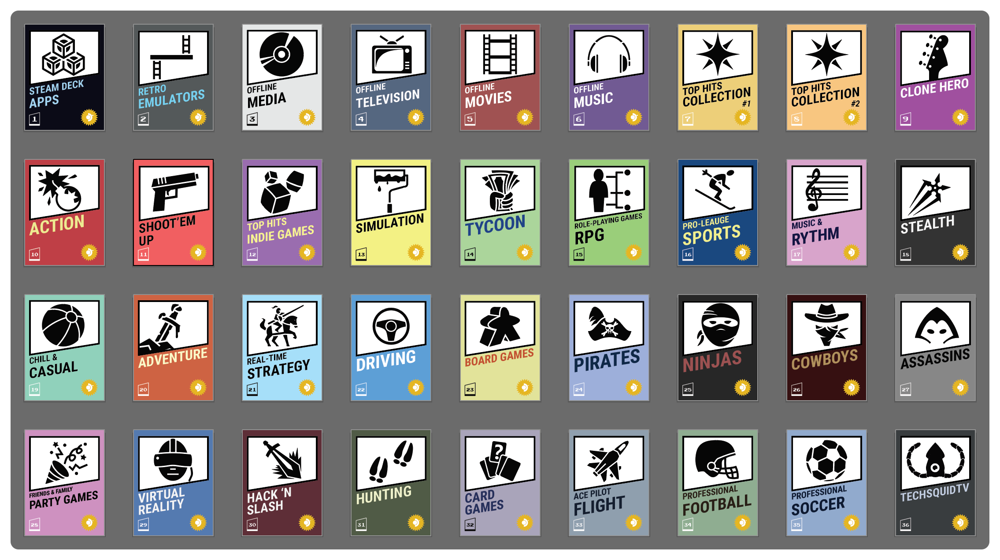
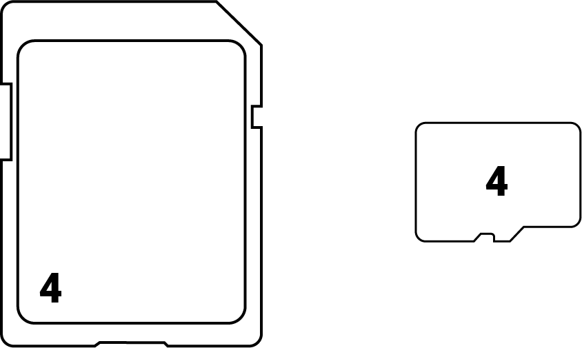

# Steam Deck Card Labels

A free/open-source physical design system for managing and organizing your Steam game library and other media on SD cards. Give your microSD card adapters game box art similar to other game cartridges.

## How to use

### 1. Print Sticker Labels

Each image fits within a 0.75" x 1" area, the typical size of a full-size SD card. You can buy label paper and print at home (typically requires a color laser printer), or print using an online service.

**Buy SD Card Adapter:** Coming soon, purchase pre-made individual SD card adapters with your preferred sticker

### 2. Label SD Card Adapters

Either cut or peel your stickers and affix them to the _full-size_ SD card adapters.

### 3. Mark MicroSD Card

Each SD Card design has an ID number mark in the bottom left corner. Use a fine-tip permanent marker to label the microSD with the corresponding number to ensure the correct card adapter is kept with the correct card.

## Credits

The icons used in these designs are from [game-icons](https://github.com/game-icons/icons), licensed under [CC BY 3.0](https://creativecommons.org/licenses/by/3.0/).

## License

[![CC BY 4.0][cc-by-shield]][cc-by]

This work is licensed under a
[Creative Commons Attribution 4.0 International License][cc-by].

[![CC BY 4.0][cc-by-image]][cc-by]

[cc-by]: http://creativecommons.org/licenses/by/4.0/
[cc-by-image]: https://i.creativecommons.org/l/by/4.0/88x31.png
[cc-by-shield]: https://img.shields.io/badge/License-CC%20BY%204.0-lightgrey.svg